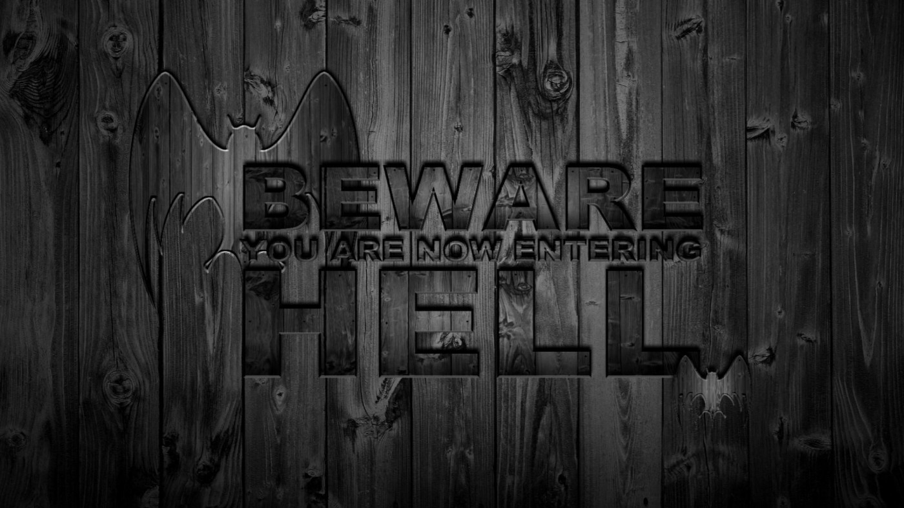

# Lucifer
<html lang="en">
<head>
  <meta http-equiv="Content-Type" content="text/html; charset=utf-8">
  <meta name="viewport" content="width=device-width, initial-scale=1.0">
  <title>Welcome to Hell</title>
  
</head>
<body>

  

    
  

<h1>Welcome to Hell</h1>

<h1>You are now entering Hell</h1>

<audio autoplay loop>
  <source src="lucifer_main_beat.mp3" type="audio/mpeg">
  Your browser does not support the audio element.
</audio>

</body>
</html>

